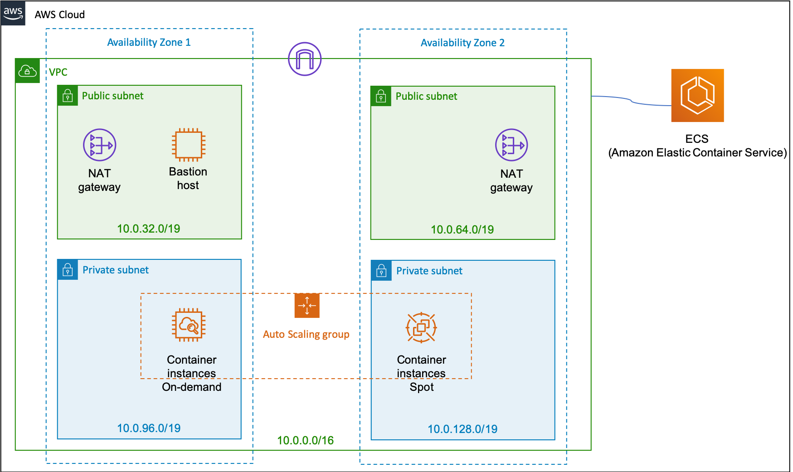

# Launch EKS/ECS  by CDK

Automated launch EKS or ECS cluster, worker nodes with Auto Scaling Group are made up by On-Demand and Spot. 


## Prerequisite

1. Install [AWS CLI](https://docs.aws.amazon.com/cli/latest/userguide/cli-chap-install.html)

2. Install [AWS SDK](https://docs.aws.amazon.com/cdk/latest/guide/getting_started.html#getting_started_install)


## ECS

### Blueprint


### Configure environment

```bash

# choose you favorite cluster name
export IS_ECS=yes
export ECS_CLUSTER_NAME=my-ecs-cluster
export AWS_DEFAULT_REGION=#?#
export AWS_ACCESS_KEY_ID=#?#
export AWS_SECRET_ACCESS_KEY=#?#

```


### Provision

```bash

npm run build
cdk deploy GoEcs

```

### Ready to go

```bash

aws ecs  list-clusters

```

## EKS

### Blueprint


### Configure environment

```bash

# choose you favorite cluster name
unset IS_ECS
export EKS_CLUSTER_NAME=my-eks-cluster
export EKS_STAGE_1=yes
export AWS_DEFAULT_REGION=#?#
export AWS_ACCESS_KEY_ID=#?#
export AWS_SECRET_ACCESS_KEY=#?#
```


### Provision

```bash

npm run build
cdk deploy GoEks

```

### Ready to go

```bash

sudo su -
kubectl get svc
kubectl get nodes

```


### Note

When you create an Amazon EKS cluster, the IAM entity user or role, such as a federated user that creates the cluster, is automatically granted system:masters permissions in the cluster's RBAC configuration. To grant additional AWS users or roles the ability to interact with your cluster, you must edit the aws-auth ConfigMap within Kubernetes.

https://docs.aws.amazon.com/eks/latest/userguide/add-user-role.html
https://stackoverflow.com/questions/50791303/kubectl-error-you-must-be-logged-in-to-the-server-unauthorized-when-accessing